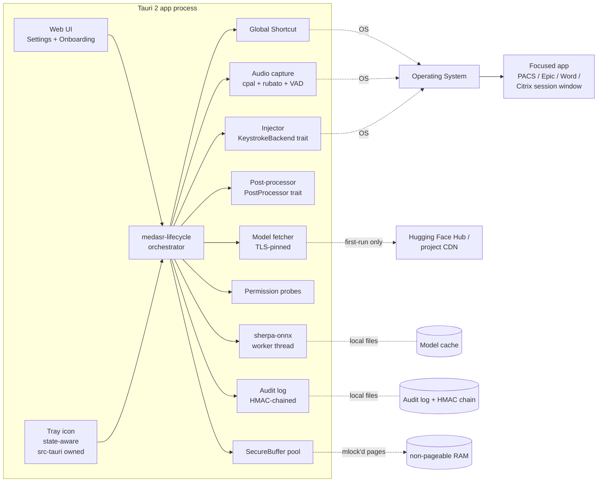
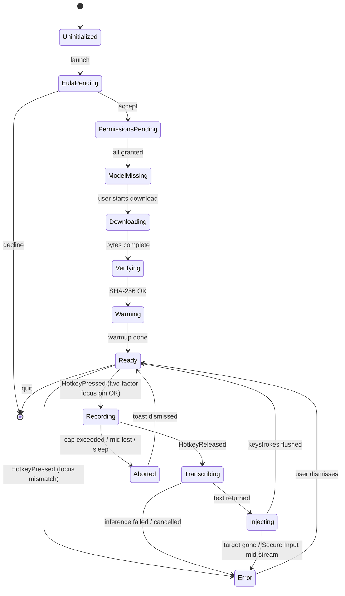

# MedASR desktop dictation app for radiologists (MVP)

## Overview

Build a cross-platform (macOS Apple Silicon, Windows x64, Linux x64) desktop dictation app for radiologists that performs **local-only** speech-to-text using Google's MedASR model. The app runs in the background, listens for a global push-to-talk hotkey, transcribes the held audio, and inserts the result at the cursor in any focused application — including PACS, Epic, and Microsoft Word — with first-class behavior inside Citrix/VDI sessions.

The product replaces (or augments) the role that Dragon Medical / Nuance occupies for radiology, but with on-device inference so PHI never leaves the workstation.

## Problem Frame

Radiologists dictate volume reports daily. Existing options are cloud-based (Dragon Medical One, Nuance DAX) which require BAAs and constant connectivity, or aging local installs (legacy Dragon) that are expensive and brittle. Google released MedASR (`google/medasr`) in December 2025 — a 105M-parameter Conformer model purpose-built for clinical dictation, achieving 4.6% WER on radiology — under the Health AI Developer Foundations license. The community (`csukuangfj/sherpa-onnx-medasr-ctc-en-int8-2025-12-25`) has already published an int8 ONNX export, making local inference practical without shipping PyTorch.

The opportunity is a small, fast, local-only desktop app that drops into a radiologist's existing PACS workflow with no cloud dependency. The hard parts are the workflow integration (global hotkey, cursor insertion, Citrix, permissions, PHI threat model) — not the model.

## Requirements Trace

- **R1.** Push-to-talk: hold a configurable global hotkey, speak, release; transcript inserted at the focused-window cursor.
- **R2.** Local-only inference. No network during transcription. No PHI leaves the device.
- **R3.** Cross-platform: macOS Apple Silicon, Windows 10/11 x64, Linux X11 x64. (Wayland deferred.)
- **R4.** First-class behavior inside Citrix Workspace, VMware Horizon, and Microsoft AVD sessions where clipboard mapping is commonly disabled. Text injection must use synthesized keystrokes.
- **R5.** Radiology-grade accuracy out of the box (use upstream MedASR; LM rescoring is a v2 feature).
- **R6.** Voice commands sufficient for dictating reports: punctuation tokens ("period", "comma", "colon", "semicolon", "question mark", "new line", "new paragraph"), open/close quotes/parens, and spelled numbers → digits with units. **Boundary:** R6 covers structural/typographic commands only. Domain expansions (e.g., "normal chest" → boilerplate paragraph) are radiology *macros* and remain out of scope for v1; the test fixture "impression colon normal" → "Impression: Normal." treats `colon` as a punctuation token, not a template trigger.
- **R7.** First-run flow that downloads/verifies the model, walks the user through OS permissions, and surfaces an HAI-DEF license acceptance.
- **R8.** No telemetry, no automatic crash reporting in v1. Tamper-evident local audit log of events (timestamps, target app metadata, error codes) — never the transcript content, never the audio.
- **R9.** Single-instance app; never two instances racing for the same hotkey.
- **R10.** Recording duration capped (90s with 60s warning) to prevent OOM on long-utterance pathology dictations.
- **R11.** PHI never persists in OS swap, hibernation images, crash dumps, error reports, or the system clipboard.

## Scope Boundaries

**In scope (v1):**
- Push-to-talk dictation with global hotkey
- Configurable hotkey (any keycode, including HID foot pedals which appear as standard keys)
- Cross-platform synthesized-keystroke text injection (no clipboard path)
- HAI-DEF EULA acceptance flow
- Model download and verification with resume, certificate pinning, and SHA-256 manifest
- Permissions onboarding (macOS TCC; Windows microphone privacy; Linux audio access)
- Tray app + simple Settings window
- Post-processing: punctuation commands, number normalization, mid-sentence capitalization fix
- Tamper-evident audit log (no PHI, no transcripts, no audio)
- OS-level memory hygiene for PHI-bearing buffers (`mlock`, zero-on-drop, WER suppression on Windows)
- Detection of concurrent microphone consumers (Teams, Zoom, voice-loggers) with user notice
- Shared OS-account safe defaults (audit log keyed by machine, not user)

**Out of scope (v2 candidates), explicitly:**
- Wayland support (X11 only on Linux for v1)
- Pseudo-streaming / real-time partial transcripts (push-to-talk is offline-batch per utterance)
- Radiology macros and report templates ("normal chest" → boilerplate)
- Vocabulary editor / custom word lists
- Per-hospital KenLM rescoring (the offline LM-training Python pipeline) — but a clean trait seam in v1 will receive this in v2 without re-architecting
- Multi-user *profiles* on shared workstations (note: shared OS *accounts* ARE supported as a default deployment topology)
- Structured-report integration (DICOM SR, FHIR)
- Foot-pedal-specific config UI (the keycode binding handles this generically)
- Auto-update infrastructure (manual installer for v1; the Tauri updater plugin is **not compiled in**, not just disabled)
- Telemetry, crash reporting, analytics
- Mobile clients
- Spanish, Portuguese, or non-English support (model is English-only)

## Context & Research

### Greenfield repository

The working directory `/Users/elostar/work/opensource/med-asr/` is empty (no git history, no prior code). All architecture decisions are unconstrained by existing patterns. As the codebase grows, populate `docs/solutions/` with learnings — especially around code-signing, Citrix-window keystroke targeting, macOS TCC quirks, and PHI memory hygiene.

### External References

- [google/medasr — Hugging Face](https://huggingface.co/google/medasr) — model card, 421 MB safetensors, requires `transformers >= 5.0.0` at commit `65dc261...`
- [MedASR Model Card — Google Health AI](https://developers.google.com/health-ai-developer-foundations/medasr/model-card) — official source, Conformer-based, 105M params, 4.6% WER radiology
- [csukuangfj/sherpa-onnx-medasr-ctc-en-int8-2025-12-25](https://huggingface.co/csukuangfj/sherpa-onnx-medasr-ctc-en-int8-2025-12-25) — community int8 ONNX export
- [sherpa-onnx repo](https://github.com/k2-fsa/sherpa-onnx) and [MedASR C API example](https://github.com/k2-fsa/sherpa-onnx/blob/master/c-api-examples/medasr-ctc-c-api.c)
- [Tauri 2 sidecar / external-bin docs](https://v2.tauri.app/develop/sidecar/) (kept as reference for the v2 Python-sidecar seam)
- [tauri-plugin-global-shortcut](https://v2.tauri.app/plugin/global-shortcut/) — supports `ShortcutState::Pressed | Released` events
- [enigo Rust crate](https://github.com/enigo-rs/enigo) — one of multiple keystroke backends; not the only one
- [cpal](https://github.com/RustAudio/cpal) — cross-platform audio capture; resamples via `rubato`
- [rtrb](https://github.com/mgeier/rtrb) — lock-free SPSC ring buffer for the audio→state-machine seam
- [DictaFlow RDP / VDI dictation](https://dictaflow.io/remote-desktop-dictation.html) — industry consensus on `SendInput` for Citrix
- [Espanso macOS Secure Input](https://espanso.org/docs/troubleshooting/secure-input/) — detection patterns
- [accessibility-sys crate](https://docs.rs/accessibility-sys) — `AXIsProcessTrustedWithOptions` wrapper
- [WerAddExcludedApplication — MS Docs](https://learn.microsoft.com/en-us/windows/win32/api/werapi/nf-werapi-weraddexcludedapplication) — disable Windows Error Reporting per process
- [VirtualLock / mlock](https://learn.microsoft.com/en-us/windows/win32/api/memoryapi/nf-memoryapi-virtuallock) — pin memory to prevent paging
- [HIPAA 45 CFR 164.312(b)](https://www.ecfr.gov/current/title-45/subtitle-A/subchapter-C/part-164/subpart-C/section-164.312) — audit-control standard
- [astral-sh/python-build-standalone](https://github.com/astral-sh/python-build-standalone) — reference for the v2 Python-sidecar seam (not used in v1)
- [HAI-DEF Terms of Use](https://developers.google.com/health-ai-developer-foundations/terms) — license that ships with model

### License correction (vs. original brief)

The brief stated MedASR is Apache 2.0. **It is not.** Code samples on the model page are Apache 2.0; the **model weights are governed by the HAI-DEF Terms of Use**, which require end-user acceptance. The plan handles this with a runtime EULA dialog at first launch (Unit 4), and records acceptance keyed by `(app_version, eula_hash)` so a downgrade re-prompts.

### Conformer + CTC implications

MedASR uses a Conformer encoder with CTC-style decoding. It is not natively streaming-friendly. Push-to-talk fits well: the full utterance is run as a single forward pass on hotkey release. Recording cap of 90s prevents long-utterance edge cases.

## Key Technical Decisions

**Inference and packaging**

- **Tauri 2 + Rust core, no Python sidecar in v1.** Use `sherpa-onnx` Rust bindings to ONNX Runtime with the int8 MedASR export. Rationale: ~125 MB total installer (vs. 600 MB–3 GB for PyTorch), no PyInstaller orphan-process bug, simpler code-signing, faster cold start. Tradeoff: tied to the sherpa-onnx ecosystem; switching models requires an ONNX export. The architecture preserves a clean `PostProcessor` trait seam (Unit 8) so v2 KenLM rescoring via a Python sidecar can plug in without re-architecting the dictation loop.
- **Model download on first run, not bundled.** The 421 MB model triples the installer; first-run download lets us also gate on EULA acceptance and disk-space pre-check. Mirror to a project-controlled CDN as a backup, with HF Hub as primary. Use `allow_patterns` to skip the 944 MB KenLM (not needed in v1).
- **Bundled release-bundle.** The Minisign public key, model-manifest with SHA-256s, and TLS pin SPKI fingerprints (see below) are bundled into one `release-bundle.bin` blob signed by a hardware-backed offline release key. Build-time verifies the blob's signature; if missing, the build fails.

**User input and output**

- **Synthesized keystrokes, no clipboard injection.** Industry default for medical/Citrix environments. PHI is never written to the system clipboard, eliminating the clipboard-manager exfiltration surface and clipboard-mapping-disabled VDI failure mode. Tradeoff: slower for very long impressions (mitigated by chunked typing).
- **`KeystrokeBackend` trait, default `enigo`, with `Win32SendInputBackend` and `FakeBackend` siblings.** `enigo` is the v1 default but the abstraction is the trait, not the crate. Direct `windows-rs`/`objc2`/`x11rb` backends are reserved for Citrix-specific quirks and ecosystem-abandonment risk. `FakeBackend` records calls for deterministic CI tests of the post-processor → injector seam.
- **Chunking is a `FocusTarget` property, not an injector property.** Native targets default to 256-char chunks with no delay; Citrix/Horizon/AVD targets default to 64-char chunks with 5ms inter-chunk delay. Backends consume the policy from the target.
- **Two-factor focus pin: `os_window_id` AND foreground-window handle, plus PID + secondary identity.** Captured at hotkey-press; revalidated at hotkey-release before injection. Composite identity (`PID + AXUIElement-on-mac / WM_CLIENT_LEADER-on-X11 / GetWindowThreadProcessId-on-Windows`) defends against window-ID recycling. If the OS-reported focused window and the foreground window of the focused process disagree at press (a known Citrix Workspace transparent-shell focus-lag bug), do not start recording — show a "click in the report and try again" toast.
- **Focus target pinned at hotkey-press, not at hotkey-release.** A radiologist often clicks images to scroll/zoom while finishing a sentence; pasting into the wrong app could leak PHI into Slack/email. If the pinned target is gone at release, abort with a clear error rather than typing into something unintended.
- **Per-chunk macOS Secure Input probe.** `IsSecureEventInputEnabled()` is checked **before every chunk**, not just at injection start. If Secure Input engages mid-stream, abort, log `INJECTION_ABORTED reason=secure_input_mid_stream`, and surface a recovery toast that names the partial-typing risk so the user can delete the half-typed text.

**Audio and inference loop**

- **VAD pre-filter before invoking the model.** Empty/non-speech audio causes Conformer-CTC models to hallucinate ("thank you for watching"). A simple energy-based VAD with a 200ms voiced threshold gates inference. Tradeoff: may suppress very quiet whispers; user can disable.
- **Recording cap: 90s with warning at 60s.** Above ~90s the model's chunked pipeline produces seam errors without an LM, and memory usage spikes. Radiology utterances rarely exceed 60s; the cap keeps the app honest.
- **Concurrent-mic-consumer detection at hotkey-press.** Enumerate processes holding the microphone (lsof on macOS, WinRT App-Capability on Windows, `pactl list source-outputs` on Linux). If another process is recording (Teams, Zoom, hospital voice-logger), surface a non-blocking notice naming the process before recording starts. The OS mic indicator (orange dot on macOS, mic LED on hardware) remains the user's last line of defense.

**PHI safety: data residence and lifecycle**

- **`SecureBuffer` for all PHI-bearing memory.** All buffers carrying audio samples, decoded transcripts, FocusTarget-side scratch, or post-processor intermediates are allocated through a wrapper that pins memory (`mlock`/`VirtualLock`), zeroes on drop, and is freed before the `Injecting → Ready` transition. macOS entitlements explicitly include the documented memory-pin entitlement.
- **OS-level dump suppression.** Windows: `WerAddExcludedApplication` + `SetErrorMode(SEM_NOGPFAULTERRORBOX)`. macOS: hardened-runtime entitlements that exclude crash collection by Apple. Linux: documented `ulimit -c 0` requirement; `prctl(PR_SET_DUMPABLE, 0)` for the process.
- **No clipboard touches at any time.** The injection path never reads or writes the system clipboard. Verified by an integration test that asserts no clipboard mutation across a full dictation cycle.

**Network egress**

- **Network egress is enforced at the OS layer, not just the Tauri capability layer.** macOS: ship a Network Extension content filter that blocks all egress except `huggingface.co` and the project CDN, and only when state ∈ {`Downloading`, `Verifying`}. Windows: WFP filter installed by the installer. Linux: documented nftables rules in the .deb post-install (best-effort). The Tauri auto-updater plugin and any Sparkle/Squirrel scaffold are **not compiled in**.
- **Certificate pinning on model download.** HTTPS connections to HF Hub and the project CDN pin against compiled-in SPKI fingerprints. On pin failure (typically a hospital TLS-intercepting firewall), abort with a specific error: "TLS interception detected — your hospital network is rewriting the connection; download the offline-install bundle instead." No fallback to system trust store.
- **No runtime network calls outside the model-download flow.** A regression test in CI runs the app in `Ready` for 60s with `lsof -nP -i` watching the process; assert zero open sockets.

**Audit log**

- **Tamper-evident audit log (HMAC chain).** Each line includes `prev_hmac` computed over `(prev_hmac || serialized_event)` keyed by a per-install secret stored in the OS keychain (Keychain / DPAPI / Secret Service). Rotation closes a segment with a terminal HMAC; the next segment chains from it. Per-install secret is rotated on a major-version upgrade. Rationale: HIPAA 45 CFR 164.312(b) audit-control floor; tampering must be detectable. Caveat: the chain does NOT prevent root-level deletion; it DOES make modification detectable on next launch.
- **Audit log is shared-account-safe.** Path: `<%LOCALAPPDATA%>\medasr\<machine-uuid>\audit.log` (no user-bound path component on shared workstations). Schema records ONLY: event type, monotonic event id, app version, error class, duration buckets quantized to 50ms, hashed app bundle ID. Wall-clock timestamps are minute-truncated. No window titles. No session IDs that could correlate to a patient case in PACS.

**Process and platform constraints**

- **HAI-DEF EULA acceptance is a hard gate.** First launch shows the license, requires explicit acceptance, records acceptance hash + timestamp + version in the audit log keyed by `(app_version, eula_hash)`. Refusal exits the app cleanly. A downgrade re-prompts (because the version changes).
- **Single-instance enforcement** via `tauri-plugin-single-instance`. Second launch focuses the existing tray; no two processes ever hold the hotkey.
- **Linux scope: X11 only.** Wayland's text injection story is fragmented; a clean X11-only v1 ships sooner. Detect `XDG_SESSION_TYPE=wayland` at startup and refuse to run with a clear error — even though X11 calls would technically work via XWayland, false-positive support is worse than honest unsupported.
- **No telemetry, no crash reporter, no Tauri updater in v1.** Eliminates the most likely PHI exfiltration vectors. Audit log is local-only and never includes transcript content.

## Open Questions

### Resolved during planning

- **Inference engine (Python sidecar vs sherpa-onnx native):** sherpa-onnx native — confirmed by user.
- **Text injection method (SendInput vs clipboard+paste):** synthesized keystrokes — confirmed by user.
- **Linux scope (X11 vs X11+Wayland vs none):** X11 only — confirmed by user.
- **Citrix/VDI support level:** first-class — confirmed by user.
- **License posture:** MedASR is HAI-DEF-licensed (not Apache 2.0). First-run EULA acceptance dialog gates further use.
- **Focus capture timing:** at hotkey-press, with two-factor identity check (PHI safety).
- **Voice command set scope:** baseline set defined in Unit 8 (period, comma, colon, semicolon, question mark, new line, new paragraph, open/close quote, spelled-number normalization).
- **Audit log integrity:** HMAC chain, per-install secret in OS keychain.
- **Network egress posture:** OS-level filter active only during downloads, plus TLS pinning.
- **Concurrent-mic-consumer policy:** detect and notify at press time; do not block.

### Deferred to implementation

- **`enigo` per-platform quirks.** May require switching some platforms to direct backends. The trait abstraction makes this localized.
- **Exact `sherpa-onnx` Rust API surface for offline batch CTC.** The C API is documented; the Rust crate may lag. Resolve in Unit 3; falling back to direct C FFI is acceptable.
- **VAD library choice.** `webrtc-vad` Rust port vs. simple energy gate vs. `silero-vad` (ONNX). Spike during Unit 2.
- **Audio resampling shape.** Whether to downsample 48 kHz → 16 kHz live (per-callback) or buffer-and-resample once on hotkey release. Resolve via measurement during Unit 2.
- **macOS Network Extension entitlement is restricted.** `com.apple.developer.networking.networkextension` with `content-filter-provider-systemextension` requires an Apple-approved Special Approval Request and is not granted automatically. Begin the entitlement request **in parallel with Unit 1, before code starts**, because denial would invalidate the macOS branch of the Key Technical Decisions egress-filter section. If denied, fall back to capability-layer + TLS-pin enforcement plus an honest narrative reduction in `docs/PRIVACY.md`.
- **Windows WFP scope: user-mode vs kernel-mode.** User-mode WFP filters require admin elevation per session and don't survive reboot unless re-added; kernel-mode requires a WHQL/attestation-signed driver and a Microsoft Hardware Dev Center account. Pick before Unit 4 — the choice changes installer architecture, signing requirements, and the IT-deployment story.
- **Hospital workstation admin-rights assumption.** Radiologists rarely have local admin. The egress-filter, Network Extension, and root nftables paths require IT/MDM-driven install. Need an explicit per-machine MSI / mac sysex MDM / .deb root-only install path before Unit 10.
- **`mlock` failure handling.** `RLIMIT_MEMLOCK` defaults are tight on Linux (often 64 KiB or 8 MiB) and macOS has no general "memory-pin" entitlement (the plan's prior framing was wrong; mlock is governed by ulimit not codesigning). Decide: when mlock fails, does the app refuse to record or fall back and document the R11 caveat? Spike during Unit 1.
- **ONNX Runtime internal allocations are not in `SecureBuffer`.** Inference-time intermediate tensors live in ordinary heap and are not mlock'd. Decide: tighten R11 to "audio + final transcript" or design a custom allocator handed to ONNX Runtime (much harder).
- **Hibernation residue.** `mlock` does not prevent hibernation from writing the full RAM image to disk on most platforms. R11's "PHI never persists in hibernation images" is not enforceable from userspace alone. Decide: weaken R11 to "best-effort against ordinary swap" or scope additional kernel-level work.
- **OS-level network filter ergonomics.** Beyond the entitlement question above, confirm operational feasibility (e.g., installer admin elevation, MDM packaging) during the Unit 4 spike before committing the architecture.
- **Tauri tray icon API surface.** The `tauri::tray` core module (`TrayIconBuilder`, `TrayIconEvent`) needs API verification during Unit 7. (Tray is in core in Tauri 2, not a plugin.)
- **Code-signing identity acquisition** (Apple Developer ID, Windows EV cert, Minisign release key) — operational, not technical. Set up in parallel with Unit 1.
- **Citrix testing matrix.** Specific Citrix Workspace versions, VMware Horizon versions, AVD configurations to test against. Define when starting Unit 4.5 (vertical slice) so we discover Citrix issues early.

## High-Level Technical Design

> *This illustrates the intended approach and is directional guidance for review, not implementation specification. The implementing agent should treat it as context, not code to reproduce.*

### Subcrate dependency graph

```
medasr-types        (FocusTarget, AudioBuffer, AsrResult, ChunkingPolicy, errors — leaf)
medasr-paths        (per-OS app data paths — depends on types)
medasr-postprocess  (pure transforms, exposes PostProcessor trait — depends on types)
medasr-state        (state machine — depends on types)
medasr-audio        (cpal/rubato/vad — depends on types)
medasr-asr          (sherpa-onnx — depends on types)
medasr-inject       (KeystrokeBackend trait + per-OS impls — depends on types)
medasr-focus        (per-OS window probes — depends on types)
medasr-permissions  (per-OS probes — depends on types)
medasr-hotkey       (tauri-plugin-global-shortcut wrapper — depends on types, state)
medasr-model        (fetch + verify + TLS pin — depends on types, paths)
medasr-audit        (HMAC-chained log — depends on types, paths)
medasr-settings     (depends on types, paths)
medasr-secure-buffer (mlock + zero-on-drop — depends only on libc/winapi)
medasr-lifecycle    (orchestration — depends on most peers; the only library crate allowed >3 peer deps; binaries `medasr-cli` and `src-tauri` are exempt)
medasr-cli          (Phase 1 milestone binary — depends on audio, asr, postprocess, types)
src-tauri           (Tauri glue + tray UI — depends on lifecycle and never reaches into peer crates directly)
```

Dependency rules: `medasr-types` is a leaf; `medasr-state` never depends on platform crates; `src-tauri` only depends on `medasr-lifecycle`. Enforced via a CI check (`cargo deny` or a small script).

### Component diagram (logical)



### Concurrency model

The orchestrator (in `medasr-lifecycle`) owns state. Concurrency rules:

- **State machine** runs on a dedicated Tokio task ("orchestrator"). Never blocks. Never calls into platform APIs directly.
- **Audio capture** is a synchronous `cpal` callback on an OS audio-priority thread. Samples push into a lock-free SPSC ring (`rtrb`); the orchestrator holds the consumer end. No `parking_lot::Mutex` on the audio path.
- **ASR worker** is a dedicated OS thread (CPU-bound, not async-friendly). Receives buffers via `std::sync::mpsc`. Returns transcripts via the same channel.
- **Injection** runs via `tokio::task::spawn_blocking` so the orchestrator never stalls on enigo syscalls (a 600-char chunked inject can run 50ms+).
- **Cancellation** is plumbed via `tokio_util::sync::CancellationToken`. Long-running ops (warmup, model download, ASR transcribe) accept a token. Hotkey-release-during-warmup queues the press; if warmup completes within 200ms, recording starts; otherwise the press is dropped with a `ModelNotReady` toast.
- **All PHI-bearing buffers** flow through `SecureBuffer` (mlock'd, zero-on-drop). Audio buffers, transcript strings, post-process intermediates. Freed before `Injecting → Ready`.

### State machine (push-to-talk loop)



Notable transitions:
- **HotkeyPressed-while-Recording** (double-press): debounce 200ms — ignore.
- **HotkeyPressed-while-Warming**: queue for up to 200ms; if warmup completes, transition to Recording; otherwise drop with `ModelNotReady` toast.
- **OS sleep / lock during Recording**: discard buffer (PHI safety) and surface "session interrupted" toast on wake.
- **Focus changed during Recording**: keep going; pin remains at original target.
- **Two-factor focus mismatch at press time** (Citrix focus-lag bug): do not start recording; show retry toast.
- **Target window destroyed by hotkey-release**: abort with `TargetWindowLost`. Do not fall back to clipboard.
- **`Aborted` vs `Error`**: `Aborted` = user/system interrupted, no toast (e.g., user-released-with-no-speech-detected). `Error` = action required, toast shown. Distinct so test assertions can differentiate.

## Implementation Units

Organized into three phases. Phase 1 establishes the inference foundation **and a thin vertical slice** that exercises hotkey + focus + injection before the full dictation loop is wired. Phase 2 fills in the real audio path and post-processing. Phase 3 hardens the app for shipping.

### Phase 1: Inference foundation + integration skeleton

- [x] **Unit 1: Project scaffold and subcrate workspace**

**Goal:** Initialize the Tauri 2 project as a Cargo workspace with the subcrate DAG above. Stub `medasr-secure-buffer` with mlock + zero-on-drop + entitlements. Set up CI.

**Requirements:** Foundation for R1–R11.

**Dependencies:** None.

**Files:**
- Create: `Cargo.toml` (workspace root, lists all `medasr-*` crates and `src-tauri`)
- Create: `crates/medasr-types/Cargo.toml`, `crates/medasr-types/src/lib.rs` (FocusTarget, AudioBuffer, errors)
- Create: `crates/medasr-paths/Cargo.toml`, `crates/medasr-paths/src/lib.rs` (one impl per OS)
- Create: `crates/medasr-secure-buffer/Cargo.toml`, `crates/medasr-secure-buffer/src/lib.rs` (mlock/VirtualLock + zeroize)
- Create: stub `Cargo.toml` + `src/lib.rs` for: `medasr-postprocess`, `medasr-state`, `medasr-audio`, `medasr-asr`, `medasr-inject`, `medasr-focus`, `medasr-permissions`, `medasr-hotkey`, `medasr-model`, `medasr-audit`, `medasr-settings`, `medasr-lifecycle`, `medasr-cli`
- Create: `src-tauri/Cargo.toml`, `src-tauri/tauri.conf.json`, `src-tauri/build.rs`
- Create: `src-tauri/src/main.rs`, `src-tauri/src/tray.rs` (tray icon — UI concern, lives here, not in `core/`)
- Create: `src-tauri/capabilities/default.json` — globalShortcut, fs (limited to app data), no shell, no http
- Create: `src-tauri/Info.plist` (macOS — `NSMicrophoneUsageDescription`, hardened-runtime entitlements)
- Create: `src-tauri/entitlements.plist` (`com.apple.security.device.audio-input`; hardened-runtime entitlements as required by notarization; the entitlement key `com.apple.security.cs.allow-unsigned-executable-memory` is **omitted** so the default-false hardened-runtime protection applies. Note: there is no documented Apple "memory-pin" entitlement — `mlock(2)` on macOS is callable without a code-signing entitlement and is governed instead by the per-process `RLIMIT_MEMLOCK` and the system `vm.global_no_user_wire` cap. Spike during Unit 1 to verify the available limits cover the SecureBuffer working set; if not, plan to raise rlimit via `setrlimit` at startup.)
- Create: `ui/` (Vite + vanilla TS or SvelteKit static), `ui/index.html`, `ui/src/main.ts`
- Create: `.github/workflows/ci.yml` — build+test for macOS-aarch64, windows-x64, ubuntu-x64 + a `cargo deny` step that enforces the dependency DAG
- Create: `scripts/check-dep-dag.sh` — fails CI if any crate violates the dependency rules in High-Level Technical Design
- Create: `README.md`, `LICENSE` (Apache 2.0 for our code), `.gitignore`
- Create: `docs/solutions/.gitkeep`

**Approach:**
- Tauri 2 stable (latest as of 2026-05-07).
- Workspace with explicit subcrate boundaries; `medasr-secure-buffer` is a critical primitive used by `audio`, `asr`, `inject`, `postprocess`.
- Disable Tauri default permissions; explicit allowlist.
- The Tauri auto-updater plugin is **not added to dependencies**.
- `cargo deny` enforces (a) no direct dep on `tauri` from any `medasr-*` crate except `medasr-lifecycle`, (b) no dep cycles, (c) no `reqwest`/`hyper` outside `medasr-model`.

**Patterns to follow:** None (greenfield). Mirror `tauri-apps/tauri/examples/api` for capability boilerplate; use the standard Cargo workspace layout.

**Test scenarios:**
- Happy path: `cargo build --workspace` succeeds on all three OSes.
- Happy path: `cargo tauri dev` opens an empty window on macOS, Windows, and Linux.
- Happy path: `cargo tauri build` produces a per-OS bundle (DMG, MSI, AppImage).
- Edge case: `cargo deny` rejects an attempt to add `reqwest` to `medasr-state`.
- Edge case: `scripts/check-dep-dag.sh` rejects an attempt to make `medasr-state` depend on `medasr-audio`.
- Edge case: `medasr-secure-buffer` test allocates 1 MB, fills with 0xAA, drops, asserts the underlying memory was zeroed (best-effort verification — touches the same allocator slot).
- Error path: missing entitlements file fails the macOS build with a clear error.

**Verification:**
- All three CI runners produce green builds for an empty app + scaffolded crates.
- `cargo deny check` clean.
- Dependency DAG check passes.

---

- [x] **Unit 2: Audio capture + VAD pipeline**

**Goal:** Cross-platform 16 kHz mono PCM capture with energy-based VAD gating. PHI-bearing audio buffers flow through `SecureBuffer`. Resamples from device-native rates to 16 kHz int16 for sherpa-onnx.

**Requirements:** R1, R2, R10, R11.

**Dependencies:** Unit 1.

**Files:**
- Create: `crates/medasr-audio/src/{capture.rs,resample.rs,vad.rs,buffer.rs}`
- Create: `crates/medasr-audio/tests/audio_resample.rs`
- Create: `crates/medasr-audio/tests/audio_vad.rs`
- Create: `crates/medasr-audio/tests/audio_capture_smoke.rs` (gated behind `--features integration` — requires real mic)
- Modify: `crates/medasr-audio/Cargo.toml` to add `cpal`, `rubato`, `rtrb`, optionally `webrtc-vad` or `silero-vad`

**Approach:**
- `cpal::default_host().default_input_device()` at recording start (not cached) — handles mic hot-swap.
- Negotiate format via `default_input_config()`; resample with `rubato::FftFixedIn` if not already 16 kHz mono i16.
- Audio callback pushes into an `rtrb::Producer<i16>` (lock-free SPSC). Consumer (orchestrator) drains on hotkey-release.
- Audio buffer storage uses `SecureBuffer` from `medasr-secure-buffer`.
- VAD: baseline is energy-based gate. If it does not achieve <5% false-quiet on the radiology fixture, escalate to `webrtc-vad` (Rust port). If neither meets the bar, escalate to `silero-vad` (ONNX) before changing the threshold. Always pick the simplest implementation that hits the bar.
- Cap recording at 90s; emit `RecordingApproachingCap` event at 60s.

**Patterns to follow:** None — greenfield. Reference [`cpal` README](https://github.com/RustAudio/cpal) and [`rtrb` README](https://github.com/mgeier/rtrb).

**Test scenarios:**
- Happy path: 5s of synthetic 16 kHz speech audio passed through the pipeline returns 80,000 samples within float tolerance.
- Happy path: 5s of synthetic 48 kHz audio is resampled to 16 kHz with sample count 80,000 ± resampler tolerance.
- Happy path: Audio buffer drop triggers `SecureBuffer` zeroization (asserted via test that scans the underlying bytes after drop).
- Edge case: 0s recording → empty buffer, no errors.
- Edge case: 95s of audio → truncated at 90s with cap-exceeded event.
- Edge case: Pure silence → VAD returns "no voice", buffer dropped before the model.
- Edge case: Energy spike <200ms voiced → VAD returns "no voice", dropped.
- Error path: No input device → `AudioError::NoInputDevice`, surfaced as state transition to `Error`.
- Error path: Mic disconnects mid-record → captured-so-far buffer preserved in SecureBuffer; recording state → `Aborted`; "transcribe partial?" prompt event.
- Integration: Hot-swap mic between two recordings → second recording uses new device, no error.

**Verification:**
- Unit tests pass with synthetic data.
- Manual smoke test on each OS confirms a real headset is captured at 16 kHz.

---

- [x] **Unit 3: sherpa-onnx integration and inference path**

**Goal:** Load the int8 MedASR ONNX model via sherpa-onnx Rust bindings, perform a warmup pass on first model load, and run offline batch transcription on hotkey-release. Returns a UTF-8 string and per-call latency. Supports cancellation.

**Requirements:** R2, R5, R11.

**Dependencies:** Unit 1, Unit 2 (provides input audio buffer).

**Files:**
- Create: `crates/medasr-asr/src/{sherpa.rs,warmup.rs,worker.rs}`
- Create: `crates/medasr-asr/tests/asr_smoke.rs` (gated behind `--features integration`)
- Create: `crates/medasr-asr/tests/fixtures/sample_radiology_8s.wav` (mono, 16 kHz, public-domain)
- Modify: `crates/medasr-asr/Cargo.toml` to add `sherpa-rs` (or direct FFI to `sherpa-onnx-c-api`)

**Approach:**
- `Asr::new(model_dir, cancel: CancellationToken) -> Result<Asr>` loads the recognizer.
- `Asr::transcribe(&self, samples: &SecureBuffer<i16>, cancel: CancellationToken) -> Result<String>`.
- Lazy init: model loads on first `Ready` transition.
- Warmup: 1s silence buffer to page in weights.
- Greedy CTC decode (no LM in v1).
- ASR worker is an OS thread (not Tokio task) communicating via `std::sync::mpsc`. Cancellation token plumbed through.
- Output transcript stored in a `SecureBuffer<u8>` that the post-processor consumes and zeroes.

**Execution note:** Spike sherpa-onnx Rust binding ergonomics with a 30-minute test before committing to the crate vs. raw C FFI.

**Patterns to follow:** [sherpa-onnx MedASR C API example](https://github.com/k2-fsa/sherpa-onnx/blob/master/c-api-examples/medasr-ctc-c-api.c).

**Test scenarios:**
- Happy path: 8s radiology fixture WAV → returns a non-empty transcript with WER ≤ 10% on this single sample.
- Happy path: Warmup completes in <5s on Apple Silicon, <10s on a mid-range Windows CPU.
- Happy path: Cancellation token fires mid-transcribe → worker returns `AsrError::Cancelled` within 100ms; no state corruption.
- Edge case: 100ms buffer → returns empty string or a single token; no crash.
- Edge case: Model files corrupted (truncated `.onnx`) → `AsrError::ModelCorrupt`, no panic.
- Error path: Model files missing → `AsrError::ModelMissing`; state machine transitions back to `ModelMissing`.
- Error path: OOM during inference → `AsrError::OutOfMemory`, recoverable.
- Integration: After transcription, the input `SecureBuffer<i16>` is zeroed on drop (verified by post-drop byte scan).

**Verification:**
- Smoke test prints transcript and end-to-end latency for the fixture; latency <1s on Apple Silicon, <3s on Windows CPU.

---

- [x] **Unit 4: Model download, verification, certificate pinning, and HAI-DEF EULA flow**

**Goal:** First-run flow that (a) shows the HAI-DEF Terms of Use and gates further use on acceptance, (b) downloads the int8 MedASR ONNX bundle from Hugging Face Hub (with project-controlled CDN mirror) over TLS-pinned connections, (c) verifies SHA-256 against a manifest baked + signed into the app, (d) caches into the per-user app data directory via `medasr-paths`, and (e) supports resume on interrupted downloads. Network egress is OS-filtered to allowlisted hosts during the download phase.

**Requirements:** R2, R7, R11.

**Dependencies:** Unit 1.

**Files:**
- Create: `crates/medasr-model/src/{fetch.rs,verify.rs,manifest.rs,pinned_tls.rs}`
- Create: `crates/medasr-model/src/eula.rs`, `crates/medasr-model/src/eula_text.rs` (HAI-DEF text bundled at build)
- Create: `crates/medasr-model/src/egress_filter.rs` — installs/uninstalls the OS-level network filter when entering/leaving Downloading state
- Create: `src-tauri/resources/release-bundle.bin` (combined: model-manifest with SHAs, TLS pin SPKIs, Minisign public key — Minisign-signed at release)
- Create: `crates/medasr-model/build.rs` — verifies `release-bundle.bin` signature at build time; fails the build if missing
- Create: `ui/src/onboarding/Eula.tsx`, `ui/src/onboarding/Download.tsx`
- Create: `crates/medasr-model/tests/{model_fetch.rs,model_verify.rs,tls_pin.rs}`
- Create: `crates/medasr-audit/src/lib.rs` (used here to record EULA acceptance — full impl in Unit 9A)

**Approach:**
- Direct HTTPS GET against `https://huggingface.co/<repo>/resolve/<revision>/<file>` with rustls + custom `ServerCertVerifier` enforcing SPKI pin from the release bundle. No system trust store.
- Pin a specific revision SHA in the manifest, not `main`.
- Resumable: HTTP `Range` header; partial files written with `.part` suffix; atomic rename on completion.
- Verify SHA-256 of every file against `release-bundle.bin` at download completion AND at every app launch (mmap + hash is fast).
- Pre-flight free-space check (need ~150 MB; require ~500 MB free).
- EULA bundle the verbatim HAI-DEF text in the binary; user must scroll to bottom + click "I accept"; record acceptance hash + ISO timestamp + app version + EULA text hash in the audit log; key acceptance by `(app_version, eula_hash)` so a downgrade re-prompts.
- On EULA decline: clean exit; no files written.
- Egress filter: when transitioning to `Downloading`, install the OS filter that allowlists only `huggingface.co` and the project CDN. On exit from `Verifying`, uninstall the filter. **Failsafe:** at every app launch, check whether a previous unclean shutdown left the filter installed (correlate with the unclean-shutdown lockfile from Unit 9C); if so, uninstall it before any other startup logic. Without this, an app crash mid-download would leave the user's network restricted on next boot.

**Patterns to follow:** [`huggingface_hub` resume semantics](https://huggingface.co/docs/huggingface_hub/guides/download) (informational — no Python lib).

**Test scenarios:**
- Happy path: Fresh install → EULA shown → user accepts → egress filter installed → download starts → all files arrive → SHA-256 matches → state → `Warming`.
- Happy path: Interrupted download (kill app at 50%) → relaunch → resumes from 50% byte offset → completes.
- Edge case: User declines EULA → app exits cleanly (non-zero code); no files written to disk.
- Edge case: SHA-256 mismatch (corrupt mirror) → file deleted, retry up to 2 times, then surface error.
- Edge case: Disk full mid-download → graceful error, partial file removed.
- Edge case: Existing valid cache on relaunch → skips download, transitions to `Warming`.
- Edge case: Cache exists but one file fails SHA-256 at startup → re-download only that file.
- Edge case: MITM proxy with its own CA installed in system trust → `TlsPinMismatch`, no bytes written, error toast: "TLS interception detected — use offline-install bundle".
- Edge case: User downgrades app version → EULA re-prompts because `(app_version, eula_hash)` key changed.
- Edge case: Egress filter cannot be installed (insufficient privileges) → block download with a clear message; do not silently bypass.
- Error path: Network unreachable → exponential backoff; after 3 failures, "no internet" toast with retry.
- Error path: HF Hub returns 401 (gated repo) → fallback to project CDN; if both fail, instruct user to provide HF token.
- Integration: Audit log gains `EULA_ACCEPTED` event with HMAC chain link valid.
- Integration: `release-bundle.bin` verification at build time; build fails if signature missing.

**Verification:**
- Manual: complete a fresh-install flow on each OS, including the offline-install path.
- Audit log file under `<%LOCALAPPDATA%>\medasr\<machine-uuid>\audit.log` contains the EULA acceptance record with valid HMAC chain.

---

- [ ] **Unit 4.5: Vertical-slice placeholder loop**

**Goal:** Validate the integration spine — hotkey press → two-factor focus pin → 200ms pause → injection of the literal string `"MEDASR PLACEHOLDER"` into the captured target — across macOS, Windows, Linux X11, AND inside Citrix Workspace 2412. Surfaces Citrix keystroke-fidelity issues, focus-pin races, hotkey conflicts, and Secure Input early.

**Requirements:** R1, R3, R4 (Citrix), R9.

**Dependencies:** Unit 1.

**Files:**
- Create: `crates/medasr-hotkey/src/lib.rs` (real, not stub)
- Create: `crates/medasr-focus/src/{macos.rs,windows.rs,linux_x11.rs,lib.rs}` (two-factor pin)
- Create: `crates/medasr-inject/src/{lib.rs,trait.rs,enigo_backend.rs,fake_backend.rs}` (KeystrokeBackend trait + first impl)
- Create: `crates/medasr-cli/src/main.rs` (placeholder CLI: subscribe to hotkey, capture focus, inject placeholder string)
- Create: `crates/medasr-state/src/lib.rs` (minimal state machine, just enough for press/release)
- Modify: `Cargo.toml` to add `tauri-plugin-global-shortcut`, `tauri-plugin-single-instance`, and per-OS focus crates (`active-win-pos-rs` or `objc2`/`windows-rs`/`x11rb` direct)

**Approach:**
- This is a thin slice. Audio, ASR, post-processing, model download, EULA — all bypassed.
- Hotkey press → call `focus::capture()` → log the FocusTarget → start a 200ms timer → on release (or timer fire), call `inject::inject_string("MEDASR PLACEHOLDER", &target)`.
- Two-factor pin implemented here for the first time — captures both `os_window_id` and `foreground_window` and PID + secondary identity.
- `KeystrokeBackend` trait + `EnigoBackend` impl + `FakeBackend` impl.

**Patterns to follow:** [Tauri global shortcut docs](https://v2.tauri.app/plugin/global-shortcut/), [enigo examples](https://docs.rs/enigo/).

**Test scenarios:**
- Happy path: macOS TextEdit focused, hotkey press → "MEDASR PLACEHOLDER" appears at cursor.
- Happy path: Windows Notepad focused, same.
- Happy path: Linux X11 xterm focused, same.
- Happy path: **Citrix Workspace 2412 published Notepad focused**, hotkey press from local OS → "MEDASR PLACEHOLDER" appears in the Citrix-hosted Notepad. This is the load-bearing test for R4.
- Edge case: Two-factor pin: focus-foreground mismatch at press → recording does not start; "click in the report and try again" toast.
- Edge case: User clicks elsewhere between press and timer-fire → injection still goes to the original FocusTarget.
- Edge case: Original FocusTarget destroyed before injection → abort with `TargetWindowLost`.
- Edge case: Window-ID recycle — destroy the original window and open a new one with the same OS ID before release → `TargetWindowLost` (PID/secondary-identity mismatch catches this).
- Edge case: Wayland session detected (`XDG_SESSION_TYPE=wayland`) → app refuses to start with documented error.
- Error path: Hotkey conflict (already registered by another app) → clear UI message + retry with another binding.
- Integration: `FakeBackend` records that a 500-char Citrix-target injection produces 8 calls of 64 chars at 5ms intervals.

**Verification:**
- Manual matrix: macOS, Windows, Linux X11, Citrix Workspace 2412 all complete the placeholder loop end-to-end.
- Document Citrix versions tested in `docs/CITRIX.md` (created in this unit).

### Phase 2: Real dictation loop

- [ ] **Unit 5: Push-to-talk state machine integration**

**Goal:** Replace the placeholder CLI loop from Unit 4.5 with the full state machine driving the audio → ASR → post-process → inject pipeline. Wire the orchestrator's concurrency model (Tokio orchestrator + audio thread + ASR worker thread + spawn_blocking injection).

**Requirements:** R1, R3, R9.

**Dependencies:** Units 1–4.5.

**Files:**
- Modify: `crates/medasr-state/src/{machine.rs,events.rs}` (full state machine)
- Create: `crates/medasr-lifecycle/src/{orchestrator.rs,cancellation.rs}`
- Modify: `src-tauri/src/main.rs` to host the lifecycle orchestrator and wire to Tauri commands and the global-shortcut plugin
- Modify: `src-tauri/capabilities/default.json` to allowlist global-shortcut
- Create: `crates/medasr-state/tests/state_machine.rs`

**Approach:**
- Single-instance via `tauri-plugin-single-instance`; second launch raises the existing tray.
- State machine = enum-of-structs; explicit transition functions; invalid transitions log + ignore.
- Orchestrator owns: state, mpsc to ASR worker, spawn_blocking handle for injection, CancellationToken hierarchy.
- Sleep/wake handled by `medasr-lifecycle::sleep` (defined in Unit 9C) — for now, subscribe to events.

**Patterns to follow:** [Tauri global shortcut docs](https://v2.tauri.app/plugin/global-shortcut/), [tokio_util CancellationToken](https://docs.rs/tokio-util/latest/tokio_util/sync/struct.CancellationToken.html).

**Test scenarios:**
- Happy path: Ready → press → state == Recording, audio capture started, FocusTarget populated.
- Happy path: Recording → release → state == Transcribing, audio buffer dispatched, capture stopped.
- Happy path: Transcribing → ASR returns text → state == Injecting, then → Ready.
- Edge case: Press → release within 50ms → VAD gates out → Ready with `NoSpeechDetected`, no model invocation.
- Edge case: Press → press → release. Second press debounced; release ends one session.
- Edge case: Recording → OS sleep → state == Aborted, buffer SecureBuffer-zeroed; on wake, state → Ready with toast.
- Edge case: Recording → 90s cap exceeded → state == Aborted, "recording too long" toast.
- Edge case: Press during Warming → press queued for 200ms; warmup completes → Recording starts. Or warmup doesn't complete → press dropped with `ModelNotReady` toast.
- Edge case: Release during ASR transcription → cancellation token fired; worker returns `Cancelled` within 100ms; state → Aborted.
- Error path: Hotkey registration fails → "hotkey conflict" toast; settings let user pick another.
- Integration: Hotkey press → focus check → recording start happens within 50ms.
- Integration: Full press→release→type cycle leaves no `SecureBuffer` allocations (verified via instrumentation count).

**Verification:**
- State machine unit tests cover all transitions both directions.
- Manual: pressing the hotkey lights the tray icon "recording" within visibly-zero time.

---

- [ ] **Unit 6: Production text injection (KeystrokeBackend, Citrix-aware chunking, Secure Input mid-stream probe)**

**Goal:** Production-grade injection. Replace the Unit 4.5 placeholder string with real transcripts. Add per-chunk Secure Input probing on macOS. Add Citrix-aware chunking via `FocusTarget::chunking_policy`.

**Requirements:** R3, R4, R11.

**Dependencies:** Unit 4.5 (KeystrokeBackend trait + EnigoBackend already exist), Unit 5 (provides FocusTarget from real state machine).

**Files:**
- Modify: `crates/medasr-inject/src/lib.rs` (Injector wraps KeystrokeBackend; owns chunking + Secure Input + focus revalidation)
- Create: `crates/medasr-inject/src/win32_send_input.rs` (direct windows-rs backend reserved for Citrix-specific quirks; not the v1 default)
- Create: `crates/medasr-inject/src/secure_input.rs` (macOS `IsSecureEventInputEnabled` probe)
- Create: `crates/medasr-inject/tests/{citrix_chunking.rs,secure_input.rs,fake_backend_seam.rs}`

**Approach:**
- `Injector::inject(&self, text: &SecureBuffer<u8>, target: &FocusTarget)`:
  1. Re-validate focus (PID, secondary identity, foreground sanity check, wait up to 500ms for transient modal to clear).
  2. Apply `target.chunking_policy` to split the text.
  3. For each chunk: probe Secure Input on macOS → if engaged, abort with `SecureInputBlockedMidStream`; otherwise call `backend.type_unicode_string(chunk)` then `backend.flush()`; sleep `delay_ms`.
  4. After last chunk, drop the `SecureBuffer` (zero-on-drop).
- `ChunkingPolicy` lives on `FocusTarget`. Citrix/Horizon/AVD bundle IDs map to `Vdi { chunk_chars: 64, delay_ms: 5 }`; native targets get `Native { chunk_chars: 256, delay_ms: 0 }`. App-bundle-ID-aware override table is in settings.

**Patterns to follow:** [enigo](https://docs.rs/enigo/), [windows-rs SendInput](https://docs.rs/windows/latest/windows/Win32/UI/Input/KeyboardAndMouse/fn.SendInput.html).

**Test scenarios:**
- Happy path: Inject "Findings: normal." into TextEdit on macOS → text appears verbatim.
- Happy path: Inject same string into Notepad on Windows → verbatim.
- Happy path: Inject into xterm on Linux X11 → verbatim.
- Happy path: Inject 500-char paragraph into native target → 2 calls × 256 chars (FakeBackend assertion).
- Happy path: Inject 500-char paragraph into Citrix target (FocusTarget bundle ID = `com.citrix.receiver.icaclient`) → 8 calls × 64 chars at 5ms intervals (FakeBackend assertion).
- Happy path: Unicode ("5.3 cm × 4 mm") → all characters arrive correctly.
- Edge case: macOS Secure Input engaged before injection → `SecureInputBlocked`, no keystrokes sent.
- Edge case: macOS Secure Input toggles on AFTER chunk 2 of 5 → `SecureInputBlockedMidStream`; toast names the partial-typing risk.
- Edge case: Focus target window destroyed between release and injection → `TargetWindowLost`.
- Edge case: Transient modal stole focus 100ms before injection → injector waits 500ms; focus returns; injection proceeds.
- Edge case: Foreground-window != FocusTarget at injection time (pin survived but window is not foreground) → wait 500ms; if still mismatched, abort.
- Error path: Backend returns OS-level error → `InjectError::Os(...)` with platform error code in audit log.
- Error path: Read-only target field rejects keystrokes → no error from OS but also no text; log the attempt.
- Integration: After injection, transcript `SecureBuffer` is dropped; state → Ready.
- Integration: FakeBackend test of the post-process → injector seam: golden file of post-processed text matches the FakeBackend's recorded calls byte-for-byte.

**Verification:**
- Manual matrix: macOS (TextEdit, Word, Safari URL bar, Epic web), Windows (Notepad, Word, Edge, Citrix Workspace published Notepad), Linux X11 (xterm, Firefox, gedit). Document failures by app in `docs/CITRIX.md`.

---

- [ ] **Unit 7: Permissions onboarding, concurrent-mic detection, and tray UI**

**Goal:** Walk the user through OS permissions on first launch, detect concurrent microphone consumers at hotkey-press, and host a state-aware tray icon. Tray UI lives in `src-tauri/src/tray.rs`, not `core/`, to keep `core/` headless and CLI-reusable.

**Requirements:** R7, R3, plus the concurrent-mic detection commitment.

**Dependencies:** Unit 1.

**Files:**
- Create: `crates/medasr-permissions/src/{macos.rs,windows.rs,linux.rs,lib.rs,concurrent_capture.rs}`
- Create: `ui/src/onboarding/Permissions.tsx`
- Modify: `src-tauri/src/tray.rs` (full impl; was a stub in Unit 1)
- Modify: `src-tauri/Info.plist` already has `NSMicrophoneUsageDescription` from Unit 1
- Modify: `crates/medasr-permissions/Cargo.toml` to add `accessibility-sys` (macOS), platform shims as needed
- Create: `crates/medasr-permissions/tests/permissions_macos.rs` (gated behind macOS + manual flag)

**Approach:**
- Probe-then-prompt: never trigger an OS dialog without our rationale screen first.
- macOS: Microphone via `AVCaptureDevice::requestAccessForMediaType(AVMediaTypeAudio)`. Accessibility via `AXIsProcessTrustedWithOptions`. Input Monitoring via `IOHIDCheckAccess`.
- Windows: probe mic capture; detect "Allow desktop apps to access your microphone" via WinRT `DeviceAccessInformation`.
- Linux X11: cpal-based mic detection; `XOpenDisplay` success.
- Concurrent-mic-consumer detection (`concurrent_capture.rs`): macOS `lsof | grep CoreAudio` + TCC API; Windows WinRT App-Capability + `Get-PnpDeviceProperty`; Linux `pactl list source-outputs`. At hotkey-press, if another non-system process holds the mic, surface a non-blocking notice naming the process. User can acknowledge and proceed.
- Tray icon: states (idle/grey, recording/red, transcribing/orange, error/yellow). Use the `tauri::tray` core module (`TrayIconBuilder`, `TrayIconEvent`). Click → toggle Settings.

**Patterns to follow:** [`tauri-plugin-macos-permissions` reference](https://crates.io/crates/tauri-plugin-macos-permissions).

**Test scenarios:**
- Happy path: Fresh macOS install → onboarding for Mic/Accessibility/Input Monitoring → all granted → app proceeds.
- Happy path: Fresh Windows install → onboarding succeeds with one screen.
- Happy path: Fresh Linux X11 install → cpal detects mic → onboarding succeeds.
- Edge case: macOS Accessibility already granted from prior install → screen skipped.
- Edge case: macOS Mic denied → onboarding loops with deep-link to System Settings + retry.
- Edge case: Windows global mic privacy off → specific Settings page link + retry.
- Edge case: User grants Accessibility, app force-relaunched by macOS, resumes onboarding.
- Edge case: Concurrent mic — Teams running with mic open → notice "Microsoft Teams is also listening to your microphone" surfaced; user acknowledges; recording starts.
- Edge case: All probes pass but cpal returns no input → fall through to "no microphone connected" at recording time.
- Integration: Tray icon transitions visibly grey → red → orange → grey across a full dictation cycle.
- Integration: Audit log records `CONCURRENT_MIC_DETECTED` events with hashed process names (no transcript content).

**Verification:**
- Manual: pristine VM/clean OS user account on each platform completes onboarding end-to-end.
- Tray icon transitions verified visually.

---

- [ ] **Unit 8: Post-processing (PostProcessor trait, voice commands, numbers, capitalization, paths integration)**

**Goal:** Transform raw MedASR transcripts into clinically-clean text via a `PostProcessor` trait. v1 ships an in-process pipeline (commands → numbers → caps). The trait is async-by-default so a v2 Python sidecar (KenLM rescoring) can plug in without re-architecting the orchestrator.

**Requirements:** R6.

**Dependencies:** Unit 1.

**Files:**
- Create: `crates/medasr-postprocess/src/{trait.rs,pipeline.rs,commands.rs,numbers.rs,caps.rs,lib.rs}`
- Create: `crates/medasr-postprocess/tests/{commands.rs,numbers.rs,caps.rs,golden.rs}`

**Approach:**
- `#[async_trait] pub trait PostProcessor { async fn transform(&self, text: SecureBuffer<u8>) -> Result<SecureBuffer<u8>>; }`. Async-by-default lets future sidecar implementations block on IPC without changing callers.
- v1 impl: `Pipeline { stages: Vec<Box<dyn Stage>> }`. Stages: `CommandsStage`, `NumbersStage`, `CapsStage`. Each owns its regex/maps; pure transforms; no async.
- Voice command map (case-insensitive, word-boundary):
  - "period" / "full stop" → `.`
  - "comma" → `,`
  - "colon" → `:` ; "semicolon" → `;`
  - "question mark" → `?` ; "exclamation point" → `!`
  - "open quote" → `"` (toggling); "close quote" → `"`
  - "new line" → `\n`; "new paragraph" → `\n\n`
  - "open paren" → `(`; "close paren" → `)`
- Numbers → digits + units. Curated unit map (mm, cm, mL, kg, mg, etc.). "five point three centimeters" → "5.3 cm".
- Capitalization: receive a "prior char hint" from the FocusTarget when available. If prior char is `,` or whitespace mid-sentence, lowercase the first word. Otherwise capitalize as the model produced.

**Test scenarios:**
- Happy path: "the lungs are clear period" → "The lungs are clear."
- Happy path: "five point three centimeters" → "5.3 cm".
- Happy path: "no acute findings new paragraph impression colon normal" → "No acute findings.\n\nImpression: Normal."
- Edge case: "period period period" → "..." (consecutive command tokens collapse).
- Edge case: A non-command word containing "period" (e.g., "periodical") is NOT replaced.
- Edge case: "five thousand two hundred" → "5200".
- Edge case: "one half" → "0.5". Documented.
- Edge case: Mid-sentence: prior char `,` and transcript "There is a..." → "there is a..." (lowercased).
- Edge case: Prior char unknown → capitalize as model produced.
- Edge case: Numbers followed by non-units ("five years old") → "5 years old" (no unit injected).
- Error path: Malformed model output (control chars) → stripped silently.
- Integration: Full pipeline on a 3-sentence radiology fixture matches a curated golden file.
- Integration: Transform consumes the input `SecureBuffer` and the output is a new `SecureBuffer`; the old buffer is zero-on-drop after consumption.

**Verification:**
- Golden-file tests pass for ~30 curated radiology utterances.

### Phase 3: Production readiness

- [ ] **Unit 9A: Audit log (HMAC-chained, shared-account-safe, schema-versioned)**

**Goal:** Tamper-evident append-only audit log per the Key Technical Decisions. Strictly no transcript content, no audio bytes, no precise timestamps.

**Requirements:** R8, plus HIPAA 45 CFR 164.312(b) audit-control floor.

**Dependencies:** Units 1–8 (consumers exist by Phase 3).

**Files:**
- Modify: `crates/medasr-audit/src/{log.rs,chain.rs,keystore.rs,schema.rs,lib.rs}`
- Create: `crates/medasr-audit/tests/{tamper_detection.rs,rotation.rs,shared_account.rs}`

**Approach:**
- Per-install secret stored in OS keychain (Keychain / DPAPI / Secret Service). Generated on first run if absent; rotated on major-version upgrade.
- Each event line: `{schema_v, event_type, monotonic_id, app_version, error_class?, duration_bucket?, hashed_bundle_id?, prev_hmac, hmac}`. Wall-clock NOT included; minute-truncated bucket only on rotation boundaries.
- `prev_hmac` chains every line. Rotation closes the segment with a terminal HMAC; the next segment starts with a "previous-segment-hmac" reference.
- On every launch: verify the chain from the last known good index to the tail; if a break is detected, surface a non-blocking warning and refuse to append until the user acknowledges (the existing log is preserved untouched for forensics).
- Path: `<%LOCALAPPDATA%>\medasr\<machine-uuid>\audit.log` (machine-keyed, not user-keyed; safe under shared OS accounts).
- Hashed bundle ID: HMAC over the bundle string with the per-install secret. So "was Epic open at minute X" is not derivable to a third party.
- Rotation at 10 MB.

**Test scenarios:**
- Happy path: App start → `APP_STARTED` event with valid HMAC chain link.
- Happy path: Hotkey press in Word → `DICTATION_REQUESTED` with hashed bundle ID; chain valid.
- Edge case: Audit log rotates at 10 MB; `audit.1.log` archived; new segment starts with reference to prior terminal HMAC.
- Edge case: Tamper test — flip any byte of `audit.log` → next launch detects the break, refuses to append, surfaces warning UI.
- Edge case: Per-install secret rotated → existing log is segmented; new appends use new key; verifier accepts both segments.
- Edge case: Shared OS account (two users, same machine) → both share the machine-keyed log; reverse-identification of any patient case from log content is not feasible (verified by attempting it).
- Error path: OS keychain inaccessible (e.g., DPAPI unavailable) → app refuses to start with a clear error.
- Integration: Full dictation flow generates the expected sequence: `HOTKEY_PRESSED`, `RECORDING_STARTED`, `RECORDING_STOPPED`, `INFERENCE_STARTED`, `INFERENCE_COMPLETED`, `INJECTION_STARTED`, `INJECTION_COMPLETED`. Chain valid.

**Verification:**
- Tail audit.log during a session, confirm no PHI ever appears.
- Tamper test: random byte flip → break detected on next launch.

---

- [ ] **Unit 9B: Settings persistence**

**Goal:** Schema-versioned settings stored in app data. Forward-only migrations.

**Requirements:** Operational.

**Dependencies:** Unit 1 (paths), Unit 9A (audit log records settings load failures).

**Files:**
- Modify: `crates/medasr-settings/src/{persist.rs,schema.rs,migrate.rs,lib.rs}`
- Create: `ui/src/Settings.tsx`
- Create: `crates/medasr-settings/tests/settings_roundtrip.rs`

**Approach:**
- Path: `medasr-paths::settings_path()`.
- Format: JSON with `schema_v`. Forward-only migrations.
- Atomic write: write to `.tmp`, fsync, rename.

**Test scenarios:**
- Happy path: write defaults → read → mutate → write → read; equality holds.
- Edge case: Settings file corrupted → use defaults, log `SETTINGS_LOAD_FAILED` to audit, surface toast.
- Edge case: Older schema version → migration runs forward; resulting file is current schema.
- Error path: Disk full at write time → atomic rename fails; previous settings preserved; error toast.

**Verification:**
- Round-trip equality test passes.
- Migration test from v1 to current schema succeeds.

---

- [ ] **Unit 9C: Lifecycle (sleep/wake, single-instance, error UX)**

**Goal:** Tie the orchestrator into OS lifecycle events; provide distinct error toasts.

**Requirements:** R9, R10.

**Dependencies:** Units 1–9B.

**Files:**
- Modify: `crates/medasr-lifecycle/src/{sleep.rs,single_instance.rs,error_ux.rs}`
- Create: `ui/src/ErrorToast.tsx`
- Create: `crates/medasr-lifecycle/tests/sleep_wake.rs`

**Approach:**
- Sleep/wake: `NSWorkspaceWillSleepNotification` (macOS), `WM_POWERBROADCAST` (Windows), `org.freedesktop.login1` (Linux). On sleep during Recording, abort + zeroize SecureBuffer. On wake, re-enumerate audio device.
- Single-instance: `tauri-plugin-single-instance`.
- Error toasts (distinct): `NoSpeechDetected`, `MicrophoneLost`, `TargetWindowLost`, `SecureInputBlocked`, `SecureInputBlockedMidStream`, `InferenceFailed`, `RecordingTooLong`, `ModelNotReady`, `TlsPinMismatch`, `WaylandNotSupported`. Each maps to a documented help link.

**Test scenarios:**
- Happy path: app start → audit `APP_STARTED` event.
- Edge case: Sleep during recording → `RECORDING_ABORTED reason=os_sleep`; SecureBuffer asserted zeroed.
- Edge case: Crash mid-transcription → next launch detects unclean shutdown via lockfile, logs `UNCLEAN_SHUTDOWN`, prompts user.
- Edge case: Second instance launched → first instance's tray comes to attention; second exits 0.
- Integration: Each error variant produces its specific toast and audit log event class.

**Verification:**
- Manual sleep/wake on each OS during a recording.
- Unclean-shutdown detection works after `kill -9`.

---

- [ ] **Unit 10: Build, code-sign, notarize, package per platform**

**Goal:** Produce signed, notarized installers for macOS (.dmg, signed + notarized), Windows (.msi or .exe, EV-signed), and Linux X11 (.AppImage and .deb). Document the release process. Validate the egress-filter installer flow on each OS.

**Requirements:** Operational.

**Dependencies:** All prior units.

**Files:**
- Modify: `src-tauri/tauri.conf.json` (bundle settings, signing identities)
- Modify: `src-tauri/entitlements.plist` (already has audio-input; no other entitlements added — `mlock(2)` on macOS is callable without a code-signing entitlement, governed by `RLIMIT_MEMLOCK`, see Unit 1)
- Create: `.github/workflows/release.yml` (per-OS build matrix; uses repo secrets for signing)
- Create: `docs/RELEASE.md` (manual release runbook for the first release; automate later)
- Create: `scripts/{notarize-macos.sh,sign-windows.ps1,build-linux.sh}`
- Create: `installer/windows/wfp-filter-installer.{c,wxs}` — installs/uninstalls the WFP egress filter
- Create: `installer/linux/postinst.sh` — documents nftables rules; does not enforce

**Approach:**
- macOS: Apple Developer ID Application; Tauri's bundler invokes `codesign` and `xcrun notarytool`. Stapling required.
- Windows: EV Code Signing Certificate preferred for SmartScreen reputation. Installer also installs the WFP egress filter as a service (disabled at install, enabled by app at runtime).
- Linux: AppImage + .deb. nftables rules documented but not auto-installed.
- `release-bundle.bin` is signed by the offline Minisign release key; `medasr-model/build.rs` verifies the signature at build time.
- Tagged commits trigger CI matrix; artifacts uploaded to GitHub Releases; SHA-256 + Minisign signatures published alongside.

**Test scenarios (release-time, not unit tests):**
- Built `.dmg` on a clean macOS VM passes Gatekeeper + notarization staple.
- Built `.msi` on a clean Windows 10/11 VM installs (post-EV-cert without SmartScreen warning); WFP filter registered.
- Built `.AppImage` on Ubuntu 22.04 launches without errors.
- Each artifact, on a fresh user account, completes EULA + onboarding + first dictation.
- `release-bundle.bin` signature mismatch in CI → release build fails.
- Egress-allowlist regression test: app run for 60s in Ready → 0 sockets open.

**Verification:**
- Three signed installers in a GitHub Release.
- Release runbook validates end-to-end on three clean VMs.

## System-Wide Impact

- **Interaction graph:** the global hotkey registers OS-wide; foot pedals appear as ordinary keys (no special path needed). Audio capture grabs the default input device, which can change between recordings — re-enumerate every cycle. Network egress is OS-filtered to allowlisted hosts, only during the model-download phase.
- **Concurrency model:** orchestrator (Tokio task) + audio thread (cpal callback into `rtrb` SPSC ring) + ASR worker (OS thread) + injection (`spawn_blocking`). Cancellation via `CancellationToken`. UI never blocks on `enigo` syscalls.
- **Error propagation:** failures must surface in the dictation cycle they belong to. A `MicrophoneLost` during recording must not trigger `InferenceFailed` later — the state machine aborts cleanly first. `Aborted` (no toast) and `Error` (toast required) are distinct.
- **State lifecycle risks:** the `Injecting` state holds a captured FocusTarget and a `SecureBuffer<u8>` of the post-processed transcript. If the user logs out or the target app crashes between hotkey-release and injection, the typing must NOT be retried elsewhere. Default action: drop the SecureBuffer (zero-on-drop) and surface error.
- **PHI memory hygiene:** all PHI-bearing buffers (audio, transcript, post-process intermediates) flow through `SecureBuffer`. Mlock'd on alloc; zeroed on drop. WER suppressed on Windows; macOS hardened-runtime entitlements exclude crash collection by Apple. No path persists PHI to disk.
- **Network egress:** OS-level filter (Network Extension on macOS, WFP on Windows, documented nftables on Linux) actively blocks all egress except to the model-download allowlist, and only while Downloading/Verifying. The Tauri auto-updater is **not compiled in**. Verified by an `lsof -nP -i` regression test in CI.
- **API surface parity:** there is no API surface — single-process desktop app. The only "external contracts" are (a) the on-disk audit log schema (versioned in `medasr-audit::schema`) and (b) the settings schema (versioned in `medasr-settings::schema`).
- **Integration coverage:** the full hotkey → audio → ASR → post-process → inject loop is best validated by integration tests with FakeBackend at the injection seam (deterministic) plus a manual smoke-test script per OS for real-mic / real-window coverage. The Citrix path is exercised in Unit 4.5 specifically and Unit 6 broadly.
- **Unchanged invariants:** no PHI ever leaves the device. No clipboard writes. No network calls during transcription. No crash reports auto-uploaded. No transcript or audio in audit log. No telemetry. PHI buffers never paged to swap or hibernation.

## Risks & Dependencies

| Risk | Likelihood | Impact | Mitigation |
|------|-----------|--------|------------|
| sherpa-onnx Rust binding lags or has bugs blocking MedASR | Medium | High | Spike at start of Unit 3; fall back to direct C FFI to `sherpa-onnx-c-api` if needed |
| MedASR HAI-DEF license blocks redistribution alongside the app | Low | High | We don't redistribute weights — first-run download. EULA gate keyed by `(app_version, eula_hash)`. Confirm with legal before public release |
| Citrix Workspace 2412+ keystroke fidelity bugs | Medium | High | Unit 4.5 vertical slice tests Citrix early; `KeystrokeBackend` trait lets us swap to direct `windows-rs` SendInput backend without touching callers |
| `enigo` ecosystem abandonment / version-skew with Tauri 2 | Low | Medium | Trait abstraction (`KeystrokeBackend`) makes per-OS swap to direct `windows-rs`/`objc2`/`x11rb` localized |
| macOS Secure Input blocks injection silently mid-stream | Medium | High | Per-chunk probe with explicit mid-stream abort + named-risk toast |
| Windows AV/EDR (CrowdStrike, Defender) quarantines the binary | Medium | Medium | EV-sign installer; publish SHA-256 manifest for hospital IT allowlisting; document allowlist requirements |
| Long-utterance OOM during inference | Low | Medium | 90s recording cap; warn at 60s; ONNX Runtime int8 has predictable peak memory |
| Hotkey conflict with another app | High | Low | On registration failure, surface conflict; allow user to pick a new hotkey |
| Linux X11 user runs Wayland session by accident | High | Medium | Detect `XDG_SESSION_TYPE=wayland`; refuse to run with clear error rather than allow XWayland fallback |
| HF Hub rate-limits or goes down during a customer's first run | Low | High | Project CDN mirror; manifest pins SHAs; offline-install bundle for hospitals |
| Hospital IT TLS-intercepts HF Hub | Medium | High | SPKI cert pinning compiled into binary; pin failure → instruct user to use offline-install bundle |
| Hospital IT blocks HF Hub domain | High | Medium | Project CDN mirror domain documented for IT allowlisting; offline-install bundle ships separately |
| Radiologist dictates PHI into wrong window via window-ID recycling | Low | Critical | Two-factor focus pin (focused + foreground), composite identity (PID + secondary handle); abort on mismatch |
| **PHI persists in OS swap / hibernate / minidumps** | Medium | Critical | `SecureBuffer` (mlock'd, zero-on-drop); WER suppression on Windows; `prctl(PR_SET_DUMPABLE, 0)` on Linux; macOS hardened-runtime crash exclusion |
| **Audit metadata reverse-identifies patient case on shared workstation** | High | High | Minute-quantized timestamps; HMAC-hashed bundle IDs; no window titles; machine-keyed log path |
| **Audit log tampering undetectable** | Medium | High | HMAC chain with per-install secret; chain verified on every launch; tamper detection refuses appends until acknowledged |
| **Hidden runtime telemetry from a transitive crate exfiltrates data** | Medium | Critical | OS-level egress allowlist filter (Network Extension / WFP / nftables); `lsof` regression test in CI; Tauri updater plugin not compiled in |
| **Concurrent mic capture by Teams/Zoom/voice-loggers** | High | High | Detect at hotkey-press; non-blocking notice naming the process; user acknowledges before recording. The mic LED / macOS orange-dot is the user's last line of defense |
| **Async cancellation incomplete — hotkey released mid-Warming or mid-ASR leaks resources** | Medium | Medium | Explicit `CancellationToken` plumbing throughout long-running ops; orchestrator owns the token; tested in Unit 5 |
| Code-signing certificate procurement delays release | Medium | Medium | Begin certificate procurement in parallel with Unit 1 |
| **macOS Network Extension entitlement denied or delayed by Apple** | Medium-High | High | Begin Apple Special Approval Request in parallel with Unit 1; have a documented fallback (capability-layer + TLS-pin + honest privacy narrative) ready to swap in if denied |
| **Citrix keystroke fidelity not yet verified** | Medium | Critical | Run a 30-min `enigo::type_str` smoke against Citrix Workspace 2412 BEFORE Unit 1 (treat as "Unit 0"). If it fails, the v1 architecture must change before code starts |
| **`mlock` fails (RLIMIT_MEMLOCK too low; macOS limits)** | Medium | High | Spike at Unit 1; either raise rlimit at startup, document the failure-fallback policy, or weaken R11 to "best-effort" |
| **ONNX Runtime internal tensors are PHI-bearing but not mlock'd** | High | Medium | Tighten R11 scope to audio + final transcript only, OR design custom allocator for ONNX Runtime (significantly larger work) |
| MedASR misidentifies medical jargon outside training distribution | High | Medium-High | Document known weaknesses (post-2015 drug names, ESL accents) in Settings/About; commit to a per-deployment WER measurement plan even informal; LM rescoring deferred to v2 only if early field WER stays acceptable |

## Alternative Approaches Considered

- **Python sidecar with HF Transformers** (the original brief). Rejected: ~600 MB CPU torch on Windows, ~3 GB CUDA torch, PyInstaller orphan-process bug, complex code-signing, slower cold start. ~25× installer-size cost for no v1 benefit. The v1 architecture preserves a clean `PostProcessor` trait seam so a v2 Python sidecar can plug in for KenLM rescoring without re-architecting.
- **Electron + Node.js + ONNX Runtime Web**. Rejected: heavier runtime, worse cross-platform global-hotkey, weaker native keystroke synthesis.
- **Clipboard + Cmd/Ctrl+V text insertion**. Rejected: routinely disabled by hospital Citrix policy; clipboard managers capture PHI. SendInput is the medical-industry default.
- **Stream partial transcripts as user speaks**. Rejected for v1: MedASR is offline-batch chunked, partial decoding causes visible jitter, push-to-talk maps better onto radiologist workflow.
- **Native Swift / WinUI / GTK apps per platform**. Rejected: 3× development surface.
- **MLX for Apple Silicon** instead of ONNX Runtime CPU. Rejected for v1: no community MLX export of MedASR yet; ONNX is fast enough for 105M params.
- **Bundle the model in the installer**. Rejected: triples installer size; bypasses HAI-DEF EULA gate; harder for hospital MSI deployments.
- **Single `core/` crate vs. subcrate workspace**. Rejected the single-crate path: hides logical dependency cycles, slows incremental builds on Windows CI, makes the headless-CLI seam (Phase 1 milestone) require linking everything. Subcrate workspace with explicit DAG is the chosen shape.
- **Soft network egress (capability flag only)** vs. OS-level filter. Rejected the soft option: a transitive crate can open a socket the implementer never intended; the Tauri capability layer doesn't gate the Rust core's network calls. OS-level filter is the only way to make the "no PHI exfiltration" claim defensible.
- **Trust system trust store for HF Hub** vs. SPKI pinning. Rejected: hospital networks routinely TLS-intercept; without pinning, a transparent proxy can swap model bytes AND the manifest response in the same flow.
- **Single audit log path keyed to OS user** vs. machine-keyed. Rejected: shared OS accounts are a real deployment topology in radiology reading rooms; machine-keyed path makes shared-account safe by default.

## Phased Delivery

**Phase 1: Inference foundation + integration skeleton** (Units 1–4.5).

Two milestones:
- **1A:** CLI demo records 5s from the mic, runs MedASR, prints a transcript.
- **1B:** GUI placeholder loop — hotkey press → focus capture → injection of the literal "MEDASR PLACEHOLDER" into a real focused window, including a Citrix Workspace 2412 published target.

This frontloads the Citrix and focus-pin risks before the full audio→ASR loop is wired.

**Phase 2: Real dictation loop** (Units 5–8).

Milestone: a working tray app where pressing the hotkey records audio, transcribes, post-processes, and types into Notepad/TextEdit/xterm. End-to-end usable for radiology dictation.

**Phase 3: Production readiness** (Units 9A, 9B, 9C, 10).

Milestone: signed, notarized installer that a radiologist can install on a fresh workstation and use without seeing developer warnings. First external test deploy.

## Documentation Plan

- `README.md`: install, first-run, dictation, settings, troubleshooting.
- `docs/RELEASE.md`: build + sign + notarize runbook.
- `docs/CITRIX.md`: tested Citrix/VMware/AVD versions and known limitations.
- `docs/PRIVACY.md`: HIPAA posture, audit log schema (what is and isn't logged), PHI memory hygiene, the mic-LED-as-last-line-of-defense statement, EULA acceptance lifecycle.
- `docs/IT-DEPLOYMENT.md`: hospital-IT allowlist requirements (HF Hub domain, project CDN, SHA-256 manifest), AV allowlist guidance, offline-install bundle instructions, egress-filter installer behavior.
- `docs/solutions/`: seed with learnings as the project grows.

## Operational / Rollout Notes

- v1 ships as manual installers; no auto-update infrastructure (the Tauri updater plugin is **not compiled in**).
- Audit log lives at platform-appropriate paths; hospital IT can rotate/clear without affecting app state. Tamper detection surfaces a non-blocking warning rather than locking out the user.
- Distribution: GitHub Releases for v1; mirror to a project-owned site once a domain is set up. Provide an offline-install bundle (installer + model files) for hospitals that block external domains.
- HAI-DEF compliance: track that EULA acceptance is recorded; do not record what the user does with the transcripts. EULA acceptance keys on `(app_version, eula_hash)` so a downgrade re-prompts.
- macOS: the WER-equivalent `com.apple.security.cs.disable-executable-page-protection` is NOT set. Hardened runtime is required for notarization.
- Windows: the WFP egress filter is registered at install time as a service (disabled). The app enables it only during model-download/verify and disables it on completion. Documented in `docs/IT-DEPLOYMENT.md`.
- No customer support tooling in v1; channel feedback via GitHub Issues.

## Sources & References

- [google/medasr — Hugging Face](https://huggingface.co/google/medasr)
- [MedASR Model Card — Google Health AI](https://developers.google.com/health-ai-developer-foundations/medasr/model-card)
- [csukuangfj/sherpa-onnx-medasr-ctc-en-int8-2025-12-25](https://huggingface.co/csukuangfj/sherpa-onnx-medasr-ctc-en-int8-2025-12-25)
- [sherpa-onnx — k2-fsa](https://github.com/k2-fsa/sherpa-onnx)
- [sherpa-onnx MedASR C API example](https://github.com/k2-fsa/sherpa-onnx/blob/master/c-api-examples/medasr-ctc-c-api.c)
- [Tauri 2 — Sidecar / external binaries](https://v2.tauri.app/develop/sidecar/) (kept as reference for v2)
- [Tauri 2 — Global Shortcut plugin](https://v2.tauri.app/plugin/global-shortcut/)
- [Tauri 2 — Single Instance plugin](https://v2.tauri.app/plugin/single-instance/)
- [Tauri 2 — Configuration reference](https://v2.tauri.app/reference/config/)
- [Tauri 2 — Permissions](https://v2.tauri.app/security/permissions/)
- [enigo crate](https://github.com/enigo-rs/enigo)
- [windows-rs SendInput](https://docs.rs/windows/latest/windows/Win32/UI/Input/KeyboardAndMouse/fn.SendInput.html)
- [cpal crate](https://github.com/RustAudio/cpal) and [docs.rs](https://docs.rs/cpal/latest/cpal/)
- [rubato resampler](https://github.com/HEnquist/rubato)
- [rtrb SPSC ring buffer](https://github.com/mgeier/rtrb)
- [tokio_util CancellationToken](https://docs.rs/tokio-util/latest/tokio_util/sync/struct.CancellationToken.html)
- [Apple AXUIElement docs](https://developer.apple.com/documentation/applicationservices/axuielement)
- [Espanso — macOS Secure Input handling](https://espanso.org/docs/troubleshooting/secure-input/)
- [accessibility-sys crate](https://docs.rs/accessibility-sys/latest/accessibility_sys/)
- [WerAddExcludedApplication — Microsoft Docs](https://learn.microsoft.com/en-us/windows/win32/api/werapi/nf-werapi-weraddexcludedapplication)
- [VirtualLock — Microsoft Docs](https://learn.microsoft.com/en-us/windows/win32/api/memoryapi/nf-memoryapi-virtuallock)
- [HIPAA 45 CFR 164.312 — eCFR](https://www.ecfr.gov/current/title-45/subtitle-A/subchapter-C/part-164/subpart-C/section-164.312)
- [DictaFlow — Remote desktop dictation](https://dictaflow.io/remote-desktop-dictation.html)
- [The VDI Tax — Citrix/RDP and dictation, 2026](https://medium.com/@ryanshrott/the-vdi-tax-why-citrix-rdp-kill-your-dictation-workflow-and-how-to-fix-it-7859ca3a6006)
- [HuggingFace Hub download guide](https://huggingface.co/docs/huggingface_hub/guides/download)
- [Tauri tray icon docs](https://v2.tauri.app/learn/system-tray/)
- [Building Production-Ready Desktop LLM Apps](https://aiechoes.substack.com/p/building-production-ready-desktop) (background reading)
